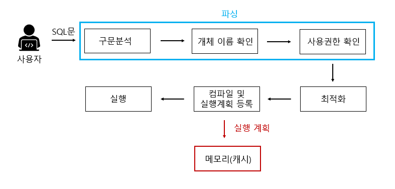
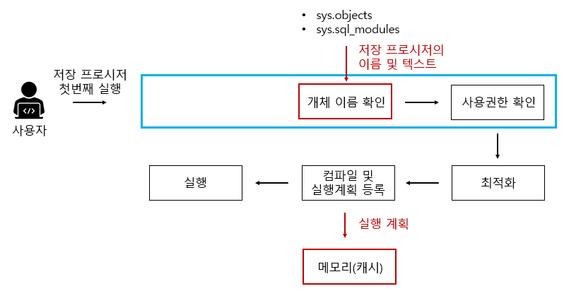

# 1. 객체/관계형 영속성 이해
다른 자카르타 퍼시스턴스 API 공급자들 알아보기
- Hibernate, EclipseLink, DataNucleus, OpenJPA, ObjectDB, TopLink Essential 와 같은 ORM 프레임워크가 있다.
저장 프로시저 이해하기
- DB 내부에 저장된 일련의 SQL 명령문들을 하나의 함수처럼 실행하기 위한 쿼리의 집합. 즉, DB에 대한 작업을 정리한 절차를 RDBMS에 저장한 쿼리의 집합이다. 
영구 저장 모듈이라고도 불린다. 여러 쿼리를 하나의 함수로 묶은 것이다.


일반적으로 쿼리문 한줄을 실행하더라도 ‘파싱 → 최적화 → 컴파일 및 실행계획 등록(실행계획 결과를 메모리에 등록) → 실행’ 하는 과정의 많은 절차를 거친다.


구문분석 단계가 빠지는 것만 빼면 일반적인 쿼리문 수행 단계와 동일하다. 저장프로시저 정의 단계의 지연된 이름 확인에서 미루어두었던 해당 개체 존재 유무를 개체 이름 확인을 통해 수행한다.

JPA는 그저 명세일 뿐이고 구현체들은 따로 존재한다.

## 1.1 영속성이란?
영속성은 일반적으로 SQL을 사용해 데이터베이스의 객체 인스턴스를 매핑하고 데이터베이스에 저장하는 것이다.

### 1.1.1 관계형 데이터베이스
SQL 데이터베이스 관리 시스템(DBMS)와 SQL 데이터베이스 차이점 이해하기
- DBMS는 데이터베이스를 관리하는 소프트웨어이며, SQL 데이터베이스는 DBMS가 관리하는 데이터베이스를 의미한다.
- "회원" 데이터베이스의 정보를 저장하고 관리하는 웹 애플리케이션을 만들려고 한다고 가정할 경우 데이터베이스를 사용하여
회원의 이름, 이메일, 비밀번호 등의 정보를 저장하고 검색할 수 있다. 이를 위해 데이터베이스 모델링을 통해 데이터베이스의 테이블과 필드를 설계한 다음, 
실제 데이터는 DBMS를 사용하여 추가, 수정 및 삭제할 수 있습니다.

데이터는 일반적으로 애플리케이션보다 수명이 길며 이를 데이터 독립성이라 한다.

### 1.1.2 SQL 이해
DQL(데이터 질의 언어)를 실행해 제한(restriction), 프로젝션(projection), 카테시안 곱(Cratesian product)과 함께 데이터 조회 가능

### 1.1.3 자바에서의 SQL 사용
CAP 이론은 시스템 장애로 인해 몇몇의 인스턴스가 다른 인스턴스와 통신할 수 없을 때 전체 데이터베이스를 어떻게 제어할 지 결정한다.
CAP 이론은 “적절한 응답 시간 내 세 가지 속성을 모두 만족시키는 분산 시스템을 구성할 수 없다”는 이론이다.
NoSQL 데이터베이스는 CP 시스템과 AP 시스템으로 분류된다. CA 시스템은 일반적으로 하나의 노드에서 동작하는 모놀리식 데이터베이스 시스템을 의미한다.

- CAP 정리는 분산 시스템에 이와 유사한 논리를 적용한다. 즉, 분산 시스템은 일관성(Consistency), 가용성(Availability 및 분할 내성(Partition tolerance)(CAP의 'C', 'A' 및 'P')의 세 가지 원하는 특성 중 두 가지만 제공할 수 있다.
- 분산 시스템은 동시에 둘 이상의 노드(물리적 또는 가상 머신)에 데이터를 저장하는 네트워크다. 모든 클라우드 애플리케이션은 분산 시스템이므로, 애플리케이션에 가장 필요한 특성을 제공하는 데이터 관리 시스템을 선택하려면 클라우드 앱의 설계 시에 CAP 정리를 반드시 이해하고 있어야 한다.
- 일관성이란 어떤 노드에 연결되었는지와 무관하게 모든 클라이언트가 동시에 동일 데이터를 볼 수 있음을 의미한다. 이러한 상황이 발생하려면, 데이터가 하나의 노드에 기록될 때마다 이 데이터는 쓰기가 '성공'으로 간주되기 전에 시스템의 다른 모든 노드로 즉시 전달되거나 복제되어야 한다.
- 가용성이란 하나 이상의 노드가 작동 중지된 경우에도 데이터를 요청하는 클라이언트가 응답을 받음을 의미한다. 이를 다른 방법으로 설명해 보면, 분산 시스템의 모든 작업 중인 노드는 예외 없이 모든 요청에 대해 유효한 응답을 리턴한다.
- 분할(Partition)이란 분산 시스템 내의 통신 단절, 즉 두 노드 간의 연결이 유실되거나 일시적으로 지연된 상태다. 분할 내성(Partition Tolerance)이란 시스템의 노드 간에 다수의 통신 단절에도 불구하고 클러스터가 계속해서 작동함을 의미한다.

NoSQL 데이터베이스는 이들이 지원하는 두 개의 CAP 특성을 기반으로 분류됩니다.
- CP 데이터베이스: CP 데이터베이스는 가용성을 희생시키면서 일관성과 분할 내성을 제공한다. 두 노드 간에 분할이 발생하면, 시스템은 분할이 해결될 때까지 일관되지 않은 노드를 종료(즉, 사용 불가능하게)해야 한다.
- AP 데이터베이스: AP 데이터베이스는 일관성을 희생시키면서 가용성과 분할 내성을 제공한다. 분할이 발생했을 때 모든 노드가 사용 가능한 상태로 유지되지만 잘못된 분할에 놓인 노드는 다른 노드보다 오래된 버전의 데이터를 리턴할 수 있다. (분할이 해결되면 AP 데이터베이스는 일반적으로 노드를 재동기화하여 시스템의 모든 불일치를 복구한다.)
- CA 데이터베이스: CA 데이터베이스는 모든 노드에서 일관성과 가용성을 제공한다. 그러나 시스템에 있는 두 노드 사이에 분할이 있으면 일관성과 가용성을 제공할 수 없기 때문에 내결함성을 제공할 수 없다.

참고 하면 좋은 내용: https://onduway.tistory.com/106

시스템은 모든 노드가 동시에 동일한 데이터를 볼 수 있고 데이터 읽기와 쓰기 요청이 항상 응답하도록 보장할 수 있다. 히지만, 호스트나 네트워크, 데이터센터 문제로 인해 시스템의 일부에 장애가 발생하면
강력환 일관성 또는 100% 가용성을 포기해야 한다.

## 1.2 패러다임의 불일치
User 및 BillingDetails 엔티티가 1:N 관계이며, 합성관계(composition, User이 존재하지 않으면 BillingDetails는 존재할 수 없음)로 존재한다면
클래스 간의 관계를 양방향으로 탐색할 수 있으므로 컬렉션을 순회하거나, 메서드를 호출해서 관계의 다른 쪽에 접근할 수 있다.
엔티티의 코드는 다음과 같다.

```java
public class User {
  private String username;
  private String address;
  private Set<BillingDetails> billingDetails = new HashSet<>();

  // 생성자, 접근자 메서드(게터/세터), 비즈니스 메서드
}
```

```java
public class BillingDetails {
  private String account;
  private String bankname;
  private User user;

  // 생성자, 접근자 메서드(게터/세터), 비즈니스 메서드
}
```

위의 엔티티들의 SQL 스키마 설계는 다음과 같다.
```sql
CREATE TABLE USERS (
  USERNAME VARCHAR(15) NOT NULL PRIMARY KEY,
  ADDRESS VARCHAR(255) NOT NULL
);

CREATE TABLE BILLINGDETAILS (
  ACCOUNT VARCHAR(15) NOT NULL PRIMARY KEY,
  BANKNAME VARCHAR(255) NOT NULL,
  USERNAME VARCHAR(15) NOT NULL,
  FOREIGN KEY (USERNAME) REFERENCES USERS(USERNAME)
);
```

이처럼 간단한 도메인 모델에서는 객체/관계형 패러다임의 불일치가 거의 나타나지 않으며, 사용자 및 청구 상세 내역에 관한 정보를
삽입, 업데이트, 삭제하는 JDBC 코드를 작성하는 것은 간단하다.
애플리케이션에 엔티티와 엔티티 관계를 더 추가하면 패러다임의 불일치를 확인할 수 있다.

### 1.2.1 세분성 문제
현재 구현의 문제점은 주소를 단순한 String 값으로 설계했다.
시, 군, 구, 우편번호 등의 정보를 별도로 저장해야 한다. User 클래스에 속성들을 직접 추가할 수 있지만 시스템의 다른 클래스에도
주소 정보가 있을 가능성이 높기 때문에 별도의 Address 클래스를 만들어서 재사용하는 편이 합리적이다.

User와 Address 간의 관계는 집합 관계이다. ADDRESS 테이블을 따로 추가하지 않고 주소 정보는 USERS 테이블의 개별 컬럼에 보관하는 것이 일반적이다.
쿼리 하나로 사용자와 주소를 조회하려는 경우 테이블 조인이 필요하지 않으므로 이 설계가 더 나은 성능을 발휘할 가능성이 높다.

가장 좋은 해결책은 새 컬럼을 여러 개 추가하는 대신 주소를 나타내는 새로운 SQL 데이터 타입을 만들고 USERS 테이블에 해당 타입의 컬럼을 추가하는 것 이다.
이처럼 여러 개의 칼럼을 추가할지 또는 새로운 SQL 데이터 타입의 컬럼 하나를 추가할지 선택하는 것은 바로 세분성(granularity) 문제이다.

데이터베이스 카탈로그에 새 데이터 타입을 추가해서 Address 자바 인스턴스를 단일 컬럼에 저장하는 것이 가장 좋은 방법처럼 보인다.
```sql
CREATE TABLE USERS (
  USERNAME VARCHAR(15) NOT NULL PRIMARY KEY,
  ADDRESS ADDRESS NOT NULL
);
```

새로운 Address 타입과 새로운 ADDRESS SQL 데이터 타입은 상호 운용성을 보장해야 한다.
하지만 오늘날의 DBMS에서 UDT(user-defined data type; 사용자 정의 데이터 타입)에 대한 지원 기능을 확인해 보면 다양한 문제를 발견할 수 있다.
- UDT 지원은 대부분 SQL DBMS에서 모호한 기능이며, 다른 제품 간의 이식성도 보장되지 않는다.
- SQL 표준은 사용자 정의 데이터 타입을 지원하지만 형편없는 수준이다.

이 문제의 실용적인 해법은 데이터베이스 공급자에서 정의한 SQL 타입으로 구성된 컬럼을 여러 개 두는 것이다.

```sql
CREATE TABLE USERS(
  USERNAME VARCHAR(15) NOT NULL PRIMARY KEY,
  ADDRESS_STREET VARCHAR(255) NOT NULL,
  ADDRESS_ZIPCODE VARCHAR(5) NOT NULL,
  ADDRESS_CITY VARCHAR(255) NOT NULL
);
```

여러 단순한 영속성 메커니즘에서는 이러한 불일치를 인식하지 못하기 때문에 결국 SQL 제품들의 표현들은 객체지향 모델에서 유연성이 떨어지는 형태가 되고 사실상 평평해지게 된다.

### 1.2.2 상속 문제
자바에서는 상위 클래스와 하위 클래스를 사용해 타입 상속을 구현한다. 이것이 왜 불일치 문제를 일으킬 수 있는지 설명하기 위해 은행계좌 청구뿐만 아니라 신용카드 청구도 허용하도록 수정한다.
상속을 사용하게 되면 BillingDetails 상위 클래스를 CreaditCard, BankAccount가 상속하는 구조로 재정의 해야합니다.
SQL 데이터베이스 제품은 일반적으로 테이블 상속을 구현하지 않으며 상속을 구현하더라도 표준 문법을 따르지 않는다. 즉 자바 클래스 구조를 지원하지 않는다.

모델에 상속을 도입하자마자 다형성이 발생할 가능성이 생긴다.
User 클래스는 BillingDetails 상위 클래스와 다형적 연관관계를 맺는다.
런타임에 User 인스턴스는 BillingDetails의 하위 클래스 중 하나의 인스턴스를 참조할 수 있다.
이와 마찬가지로 BillingDetails 클래스를 참조하고 쿼리가 BillingDetails 클래스를 참조하고 쿼리가 BillingDetails 클래스의
하위 인스턴스를 반환하는 다형적 쿼리를 작성하고 싶을 것이다.
하지만 SQL 데이터베이스에는 다형적 연관 관계를 표현할 수 있는 명확한 방법이 없다.

이러한 서브타입 불일치의 결과는 모델의 상속 구조를 상속 메커니즘을 제공하지 않는 SQL 데이터베이스에 영속화해야 한다는 것이다.

### 1.2.3 동일성 문제
자바에서는 두 가지의 동일성이 존재한다.
- 인스턴스 동일성(identity): 대략 메모리 위치와 상응하며, `a == b`로 확인된다.
- 인스턴스 동승성(equality): `equals()` 메서드의 구현에 의해 결정됨(값에 의한 동등성)
하지만 데이터베이스 로우의 동일성은 기본키 값의 비교로 표현된다.

영속성의 맥락에서 동일성은 시스템이 캐싱 및 트랜잭션을 처리하는 방식과 밀접한 관련이 있다.

### 1.2.4 연관관계 문제
자바에서의 연관관계는 다대다 다중성을 가질 수 있다.
SQL 데이터베이스에서 다대다 연관관계를 표현하려면 일반적으로 링크 테이블이라고 하는 새로운 테이블을 도입해야 한다.
대부분의 경우 이 테이블은 도메인 모델의 어디에도 나타나지 않는다.

### 1.2.5 데이터 탐색 문제
자바에서는 클래스 간에 미리 준비된 포인터를 따라 한 인스턴스에서 다른 인스턴스로 이동하고 컬렉션을 순회하기도 한다.
하지만 이 방법은 SQL 데이터베이스에서 데이터를 조회하는 효율적인 방법이 아니다.
데이터 접근 코드의 성능을 개선하기 위해 할 수 있는 가장 중요한 일은 데이터베이스에 대한 요청 횟수를 최소화하는 것이다.

SQL을 사용해 관계형 데이터에 효율적으로 접근하려면 일반적으로 관련 테이블 간의 조인이 필요하다.
데이터를 조회할 때 조인에 포함된 테이블 수에 따라 메모리상에서 탐색할 수 있는 개체망의 깊이가 결정된다.

조인을 효율적으로 사용하려면 객체망 탐색을 시작하기 전에 객체망의 어느 부분에 접근할지 알아야 한다.
거대한 카테시안 곱 결과 집합으로 인해 SQL 데이터베이스에 과부하가 걸릴 수도 있다.

어느 객체 영속성 솔루션을 사용하든 자바 코드에서 연관관계에 접근할 때만 연관관계를 맺은 인스턴스의 데이터를 가져오도록 허용한다.
이를 지연 로딩이라고 하며, 필요할 때만 데이터를 조회하는 것이다.
이러한 데이터 접근 방식은 접근하는 객체망의 각 노드 또는 컬렉션마다 하나의 SQL 문을 실행해야 하므로 SQL 데이터베이스의 맥락에서는 기본적으로 비효율적이다.
이것이 바로 n+1 문제이다.

## 1.3 ORM, JPA, 하이버네이트, 스프링 데이터
ORM은 애플레케이션의 클래스와 SQL 데이터베이스의 스키마 간의 매핑을 설명하는 메타데이터를 사용해
자바 애플리케이션의 객체를 RDBMS의 테이블에 자동으로 그리고 투명하게 영속화하는 기술이다.

JPA 명세는 다음과 같은 사항을 정의한다.
- 영속성 클래스 및 해당 클래스의 프로퍼티가 데이터베이스 스키마와 어떻게 관련돼 있는지 지정하는 매핑 메타데이터.
JPA는 도메인 모델 클래스의 자바 애너테이션에 의존하지만 XML 파일에 매핑 정보를 작성할 수도 있다.
- 영속성 클래스의 인스턴스를 대상으로 기본적인 CRUD 작업을 수행하기 위한 API. 
가장 대표적인 API로 데이터 저장과 로딩을 위한 `jarkarta.persistence.EntityManager`가 있다.
- 클래스 및 클래스의 프로퍼티를 참조하는 쿼리를 지정하기 위한 언어와 API.
이 언어를 JPQL이라 하며, SQL과 비슷한 형태를 취한다. 표준화된 API를 사용하면 문자열 조작을 하지 않고도 프로그래밍 방식으로
기준 쿼리(criteria query)를 생성할 수 있다.
- 영속성 엔진이 트랜잭션 방식으로 동작하는 인스턴스와 상호작용해 변경 감지, 연관관계 페치, 기타 최적화 기능을 수행하는 방법.
JPA 명세에서는 몇 가지 기본적인 캐싱 전략을 다룬다.